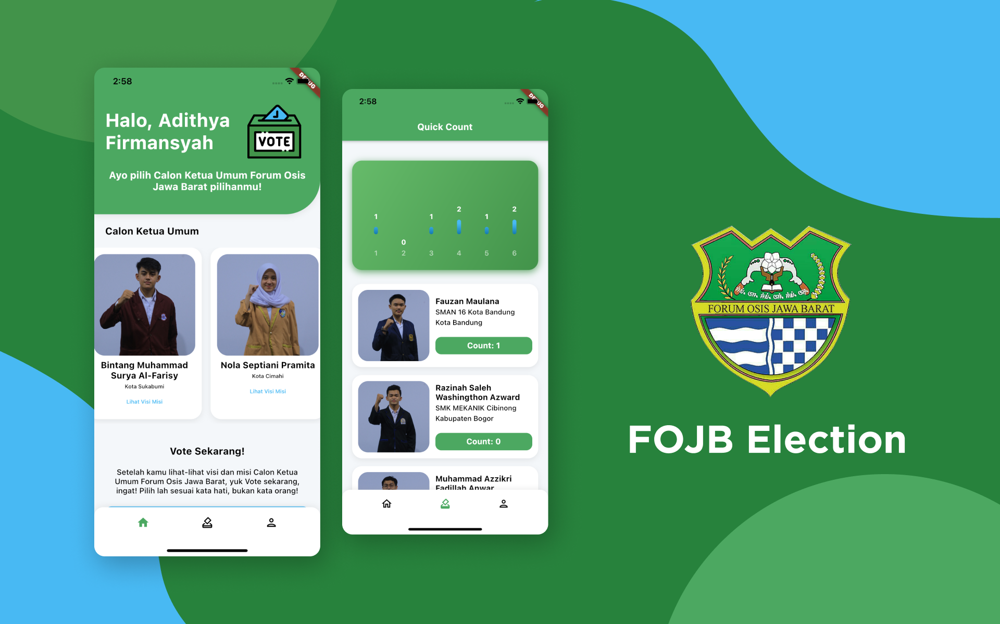
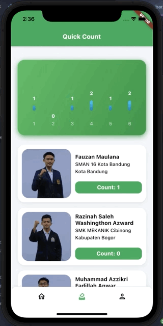

<h1 align="center">
  FOJB Election
</h1>
<p align="center">
  E-Voting App for the Election of Candidates for General Chairman of Forum Osis Jawa Barat (FOJB)
</p>
<p align="center">
  <a href="https://flutter.dev/"></a>
  <a href="https://dart.dev/"></a>
  <a href="https://github.com/Adithya-13/FOJB-election/"></a>
</p>

<p align="center">
  
</p>

## Table of Contents
- [Introduction](#introduction)
- [Installation](#installation)
- [Demo](#demo)
- [Features](#features)
- [Tech Stack](#tech-stack)
- [Dependencies](#dependencies)

## Introduction

FOJB Election is an E-Voting application for the election of the Candidate for Chairperson of the Forum Osis Jawa Barat (FOJB) in 2021. In this project, I was entrusted with developing the FOJB Election Application by Forum Osis Jawa Barat (FOJB) for the election later.

In this project, I use Firebase, namely Firebase Realtime Database & Firebase Storage, for details you can see [here](#tech-stack).

The challenge here is that I created a quick count feature, which is a new thing for me, especially using the Firebase Realtime Database for this feature. To see what features I made, you can see [here](#features).

I, use BloC as my State Management, and also use Get Storage to store state on local device. I also use Youtube Player Flutter as a Video Player in the Application to display a Video containing the Vision and Mission of the Candidate General Chair. To see what Dependencies I created, you can see [here](#dependencies).

## Installation

Clone or Download and Open it into Android Studio, VSCode, or Other IDE / Text Editor
```
https://github.com/Adithya-13/FOJB-Election.git
```  

## Demo

|Login|Home|
|--|--|
|||

|Detail Candidate|Vote|
|--|--|
|||


|Quick Count|Profile|
|--|--|
|||

## Features
- Login
- Home
- Detail Candidate
- Vote Candidate
- Quick Count
- Profile

## Tech Stack
- BloC Architecture Pattern
- BloC State Management
- Firebase Realtime Database
- Firebase Storage
- Clean Architecture (data, domain, presentation)

## Dependencies
- [Equatable](https://pub.dev/packages/equatable)
- [RxDart](https://pub.dev/packages/rxdart)
- [Flutter Bloc](https://pub.dev/packages/flutter_bloc)
- [Logging](https://pub.dev/packages/logging)
- [Flutter SVG](https://pub.dev/packages/flutter_svg)
- [Firebase Core](https://pub.dev/packages/firebase_core)
- [Firebase Database](https://pub.dev/packages/firebase_database)
- [Cached Network Image](https://pub.dev/packages/cached_network_image)
- [Auto Size Text](https://pub.dev/packages/auto_size_text)
- [Get Storage](https://pub.dev/packages/get_storage)
- [Shimmer](https://pub.dev/packages/shimmer)
- [Fl Chart](https://pub.dev/packages/fl_chart)
- [Loader Overlay](https://pub.dev/packages/loader_overlay)
- [Youtube Player Flutter](https://pub.dev/packages/youtube_player_flutter)
- [Pull To Refresh](https://pub.dev/packages/pull_to_refresh)
- [Dartz](https://pub.dev/packages/dartz)
- [Url Launcher](https://pub.dev/packages/url_launcher)


